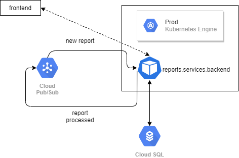

# Reports service monorepo

[](https://travis-ci.com/ega-forever/showcase-mckinsey)

The showcase demo for mckinsey [task](https://github.com/morkro/coding-challenge). The monorepo includes sub-repos:

1) [backend.services.reports](https://travis-ci.com/ega-forever/showcase-mckinsey/backend/services/reports)
2) [frontend.services.reports](https://travis-ci.com/ega-forever/showcase-mckinsey/frontend/reports)

## How to run the app?

You can start the frontend and backend (alongside with all necessary services) with single command: ```docker-compose run```

### Architecture

